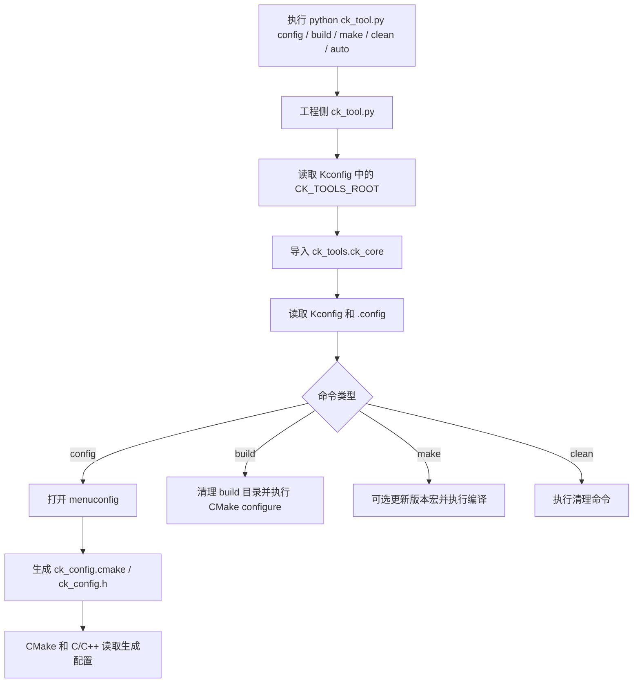

# CK Build

> CK Build 是一套面向嵌入式和小中型 C / C++ / ASM 工程的轻量级 **CMake + Kconfig 工程模板**。  
> 它用 **Kconfig 管配置**，用 **Python 固定操作入口**，用 **CMake 保留真实构建逻辑**。

CK Build 不是为了替代 CMake、Ninja、Make 或 STM32CubeMX，而是在这些工具之上提供一层统一的工程约定。
它更适合“希望工程流程统一，但仍然保留项目差异可见性”的场景。

## 配套 Skill

本仓库配套了一个给 Codex 使用的 Skill：[`skill/ck-build-skill/SKILL.md`](skill/ck-build-skill/SKILL.md)。

它主要用于：

- CK Build 的配置、构建、编译和清理。
- 修改 `Kconfig`、`.config`、`ck_config.cmake`、`ck_config.h`。
- 新增 `package`、修改 `CMakeLists.txt`，以及排查常见构建错误。

这个 Skill 的要求是优先遵守当前工程约定，不把本项目当成通用 CMake 教程。

## 一眼了解

CK Build 主要解决下面几类问题：

- 多个工程的 `config / build / make / clean` 操作方式不统一。
- Python、CMake、C / C++ 代码里重复维护同一份配置。
- 普通 C / C++ 工程和 STM32CubeMX 工程结构差异大，后续维护成本高。
- 外部模块接入时，需要反复手动修改源码、头文件、库路径和 Kconfig 开关。
- 希望使用 Kconfig 配置界面，但又不想引入 Zephyr 级别的复杂构建系统。

CK Build 的主流程很简单：

```text
python ck_tool.py config   # 打开 Kconfig 菜单，生成配置文件
python ck_tool.py build    # 执行 CMake configure
python ck_tool.py make     # 执行实际编译
```

也可以一次执行：

```text
python ck_tool.py auto     # config -> build -> make
```

## 核心设计

CK Build 采用三层边界：

| 层级 | 负责内容 | 不负责内容 |
| --- | --- | --- |
| Kconfig | 工程配置、构建命令、工具链选项、模块开关 | 不直接参与编译 |
| Python | 固定外层命令流程，执行配置生成、构建、清理和 Hook | 不隐藏 CMake 关键逻辑 |
| CMake | 组织源码、头文件、库、编译参数、链接参数和构建产物 | 不承担配置菜单职责 |

这种设计的重点是：**流程统一，差异显式**。
标准工程、STM32 工程和后续其他平台工程尽量保持相同的主流程，但平台相关的关键路径仍留在各自 `CMakeLists.txt` 中，方便用户直接修改。

## 适合的使用方式

推荐从模板工程开始：

```text
template/project/standard_project -> your_project
template/project/stm32_project    -> your_stm32_project
```

复制后通常只需要重点修改：

- `Kconfig`：项目名、工具链、构建命令、模块开关。
- `CMakeLists.txt`：平台相关编译参数、链接脚本、源码排除规则、特殊库路径。
- `ck_tool.py`：工程自己的构建前后 Hook。

CK Build 是“工程模板 + 构建辅助层”，不是完整包管理器，也不是 IDE 工程生成器。

## 推荐阅读顺序

刚接触项目时建议按下面顺序阅读：

| 顺序 | 文档 | 重点 |
| --- | --- | --- |
| 1 | [README.md](README.md) | 快速了解项目定位、目录结构和基本命令 |
| 2 | [doc/01_项目定位与整体架构.md](doc/01_项目定位与整体架构.md) | 理解 Python、Kconfig、CMake 三层边界 |
| 3 | [doc/02_安装依赖与快速使用.md](doc/02_安装依赖与快速使用.md) | 配好环境并跑通标准工程和 STM32 工程 |
| 4 | [doc/03_Kconfig配置与生成文件.md](doc/03_Kconfig配置与生成文件.md) | 理解 `.config`、`ck_config.cmake`、`ck_config.h` 的生成关系 |
| 5 | [doc/04_工程模板与模块机制.md](doc/04_工程模板与模块机制.md) | 学会复制模板、新增源码、新增外部模块 |
| 6 | [doc/05_CMake公共函数说明.md](doc/05_CMake公共函数说明.md) | 需要改 CMakeLists 时查具体函数用途 |
| 7 | [doc/06_工程迁移与版本更新说明.md](doc/06_工程迁移与版本更新说明.md) | 从旧工程迁移时阅读 |
| 8 | [doc/07_常见问题与排错.md](doc/07_常见问题与排错.md) | 遇到路径、工具链、构建产物问题时查阅 |

## 当前能力

- Kconfig 菜单配置。
- 从 `.config` 自动生成：
  - `ck_config.cmake`：给 CMake 使用。
  - `ck_config.h`：给 C / C++ 代码使用。
- Python 命令入口：`config`、`build`、`make`、`clean`、`auto`。
- C / C++ / ASM 混编。
- 标准 C / C++ 工程模板。
- STM32CubeMX 工程模板。
- 外部 package 模块扫描。
- 按 Kconfig 开关启用模块源码。
- 工具链参数从 Kconfig 导入。
- 统一输出目录。
- 可选生成 map / bin / dis / size 等构建产物。
- 可选软件版本宏更新。
- 可选 CTest 单元测试注册。
- 工程侧 Hook 扩展，不需要修改 `ck_tools` 核心代码。

## 目录结构

```text
cmake-kconfig-build-project/
├── ck_tools/
│   ├── ck_core.py              # Python 构建核心流程
│   ├── ck_config_gen.py        # .config -> ck_config.cmake / ck_config.h
│   ├── ck_version.py           # 可选版本宏更新
│   ├── ck_utils.cmake          # 基础源码 / 头文件 / 库扫描函数
│   ├── ck_project.cmake        # 工程级 CMake 公共函数
│   ├── ck_toolchain.cmake      # 通用工具链配置导入
│   └── Kconfig.toolchain       # 通用工具链 Kconfig 配置
│
├── template/
│   ├── package/                # 示例外部模块包
│   └── project/
│       ├── standard_project/   # 标准 C / C++ 工程模板
│       └── stm32_project/      # STM32CubeMX 工程模板
│
└── doc/                        # 配套文档
```

## 快速开始

### 1. 安装依赖

```bash
pip install kconfiglib
```

`menuconfig` 由 Kconfiglib 提供，代码中会通过 `import menuconfig` 启动菜单界面。

Windows 下如果 `menuconfig` 进入菜单时报 curses 相关错误，再安装：

```bash
pip install windows-curses
```

同时需要安装：

- Python 3.8 或更新版本。
- CMake 3.20 或更新版本。
- Ninja 或其他 CMake 生成器对应的构建工具。
- 标准工程需要本机 GCC / Clang / MSVC 等编译器。
- STM32 工程需要 ARM GNU Toolchain。

### 2. 运行标准工程

```bash
cd template/project/standard_project
python ck_tool.py config
python ck_tool.py build
python ck_tool.py make
```

也可以使用自动流程：

```bash
python ck_tool.py auto
```

`auto` 等价于：

```text
config -> build -> make
```

### 3. 运行 STM32 工程

```bash
cd template/project/stm32_project
python ck_tool.py config
python ck_tool.py build
python ck_tool.py make
```

STM32 工程默认通过 Kconfig 中的命令指定 toolchain 文件：

```text
cmake -S . -B build -G Ninja -DCMAKE_BUILD_TYPE=Debug -DCMAKE_TOOLCHAIN_FILE=cmake/gcc-arm-none-eabi.cmake
```

如果 ARM GCC 没有加入系统 PATH，需要修改 toolchain 文件或在环境变量中加入 `arm-none-eabi-gcc` 所在目录。

## 常用命令

| 命令 | 简写 | 作用 |
| --- | --- | --- |
| `python ck_tool.py config` | `c` | 打开 Kconfig 菜单，并生成 `ck_config.cmake` / `ck_config.h` |
| `python ck_tool.py build` | `b` | 删除并重新生成 CMake build 目录 |
| `python ck_tool.py make` | `m` | 执行实际编译命令 |
| `python ck_tool.py clean` | `cl` | 执行 Kconfig 中配置的清理命令 |
| `python ck_tool.py auto` | `a` | 依次执行 `config -> build -> make` |
| `python ck_tool.py help` | `h` | 打印命令帮助 |

## 基本流程



## 生成文件

工程执行 `config` 或 `auto` 后，会生成：

```text
.config
ck_config.cmake
ck_config.h
```

执行 `build` / `make` 后，常见输出为：

```text
build/
bin/
```

建议策略：

| 文件 | 是否建议提交 | 原因 |
| --- | --- | --- |
| `.config` | 可提交 | 表示当前工程的配置快照 |
| `ck_config.h` | 可按项目需要提交 | 如果它承载版本信息或希望代码可直接查看配置，可以提交 |
| `ck_config.cmake` | 通常不提交 | CMake 过程文件，可由 `.config` 再生成 |
| `build/` | 不提交 | 构建过程目录 |
| `bin/` | 不提交 | 构建产物目录 |

## 新建工程建议

当前推荐方式是直接复制模板工程，再修改少量配置：

```text
template/project/standard_project -> your_project
```

复制后重点检查：

1. `Kconfig` 中的 `CK_TOOLS_ROOT`。
2. `Kconfig` 中的 `CK_WORKSPACE_ROOT`。
3. `Kconfig` 中的 `CK_CMD_CONFIGURE`、`CK_CMD_BUILD`、`CK_CMD_CLEAN`。
4. `CMakeLists.txt` 中的 profile：`ck_profile_generic()`、`ck_profile_stm32()`、`ck_profile_mcu()`、`ck_profile_linux_app()`。
5. `CMakeLists.txt` 的平台扩展区和用户配置区。
6. 是否需要外部 package 模块。

## 什么时候修改哪里

| 需求 | 修改位置 |
| --- | --- |
| 改项目名 | `Kconfig` 的 `PRO_NAME` |
| 改构建命令 | `Kconfig` 的 `CK_CMD_CONFIGURE / CK_CMD_BUILD / CK_CMD_CLEAN` |
| 改工具链 | 标准工程改 `Kconfig.toolchain` 配置，STM32 工程改 toolchain 文件或 Kconfig configure 命令 |
| 新增源码 | 放入工程目录自动扫描，或在 `CMakeLists.txt` 用户配置区手动追加 |
| 排除目录 | `CMakeLists.txt` 用户配置区追加 `CK_EXCLUDE_DIRS` |
| 新增外部模块 | 在外部模块目录提供 `Kconfig` 和 `CMakeLists.txt`，再在工程 `Kconfig` 的外部模块区 `source` |
| 构建前后插入脚本 | 工程侧 `ck_tool.py` 的 `ProjectHooks` |
| 修改 STM32 平台链接 | STM32 工程 `CMakeLists.txt` 的平台链接修正区 |

## 适合与不适合

适合：

- 裸机 / RTOS / STM32CubeMX 工程。
- 小中型 Linux C / C++ 应用。
- 希望多个工程共享一套配置和构建流程。
- 希望保留 CMakeLists 可读性，而不是把所有逻辑封装成黑盒。

不适合：

- 需要完整包管理、复杂依赖图、跨仓库版本求解的大型构建系统。
- 希望所有平台差异完全自动化隐藏的场景。
- 需要完整 IDE / GUI 工程管理器的场景。

## 文档

详细说明见 `doc/` 目录：

- [01_项目定位与整体架构.md](doc/01_项目定位与整体架构.md)
- [02_安装依赖与快速使用.md](doc/02_安装依赖与快速使用.md)
- [03_Kconfig配置与生成文件.md](doc/03_Kconfig配置与生成文件.md)
- [04_工程模板与模块机制.md](doc/04_工程模板与模块机制.md)
- [05_CMake公共函数说明.md](doc/05_CMake公共函数说明.md)
- [06_工程迁移与版本更新说明.md](doc/06_工程迁移与版本更新说明.md)
- [07_常见问题与排错.md](doc/07_常见问题与排错.md)
