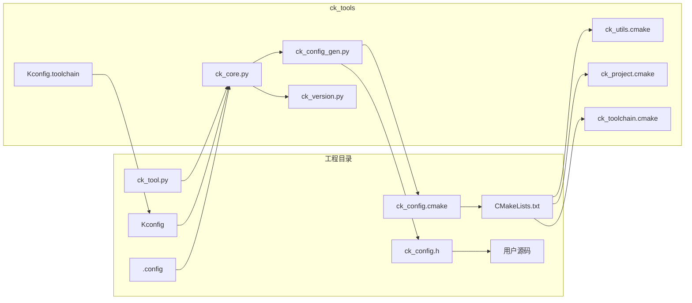
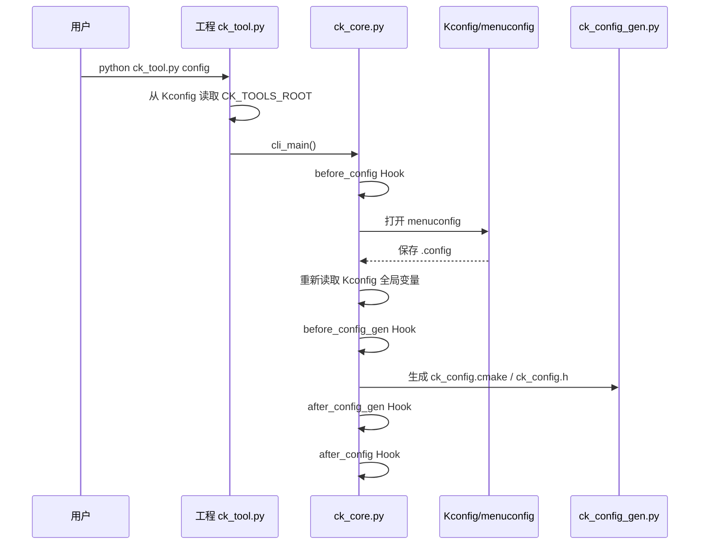

# 项目定位与整体架构

## 1. 项目定位

CK Build 是一套面向嵌入式和小中型 C / C++ 工程的轻量级工程模板。

它的重点不是替代 CMake，而是把工程中容易重复、容易散乱的部分统一起来：

- 配置入口统一：工程配置都从 Kconfig 进入。
- 构建命令统一：通过 `ck_tool.py` 调用 `config / build / make / clean / auto`。
- 配置导出统一：同一份 `.config` 同时导出给 Python、CMake 和 C/C++。
- 模板流程统一：标准工程、STM32 工程保持相同颗粒度。
- 平台差异显式：平台相关代码保留在项目 `CMakeLists.txt` 的固定区域中。
- 用户扩展显式：Python 私有流程写在工程侧 Hook 中。

一句话概括：

> CK Build 用 Kconfig 统一配置，用 Python 统一外层命令，用 CMake 保留真实构建逻辑。

## 2. 为什么不做成完整构建系统

CK Build 的目标是轻量、可复制、可修改，不追求 Zephyr 那种大型构建框架。

它明确不做以下事情：

- 不替代 CMake。
- 不替代 Ninja、Make、MSBuild 等构建后端。
- 不强制所有模块都 target 化。
- 不做复杂依赖图管理。
- 不做完整包管理器。
- 不把 STM32、Linux、其他 MCU 的差异全部隐藏成一个入口。
- 不把用户项目逻辑写死在 `ck_tools` 中。

这样做的好处是：

- 模板文件看得懂。
- 平台差异找得到。
- 用户可以按自己的工程习惯改。
- 维护多个示例工程时，公共能力能复用，差异项不会被过度抽象。

## 3. 总体架构



## 4. 三层职责边界

### 4.1 Python 层

Python 层只负责外层流程，不负责具体编译规则。

核心文件：

```text
ck_tools/ck_core.py
```

主要职责：

- 读取工程 `Kconfig` 和 `.config`。
- 从配置中取得 `CK_TOOLS_ROOT`、`CK_WORKSPACE_ROOT`、`CK_BUILD_DIR`。
- 从配置中取得构建命令：
  - `CK_CMD_CONFIGURE`
  - `CK_CMD_BUILD`
  - `CK_CMD_CLEAN`
- 执行 `menuconfig`。
- 调用 `ck_config_gen.py` 生成配置文件。
- 调用 CMake configure 命令。
- 调用构建命令。
- 可选调用 `ck_version.py` 更新版本宏。
- 调用用户 Hook。

Python 层不应该关心：

- 具体有哪些 `.c`、`.cpp`、`.s` 文件。
- 具体链接哪些库。
- STM32 的链接脚本怎么写。
- Linux 应用需要哪些系统库。

这些都应该留给 CMake 层处理。

### 4.2 Kconfig 层

Kconfig 是配置入口。

它负责管理：

- 工具路径。
- 工作区路径。
- 工程类型标识。
- Python 调用的构建命令。
- 工具链参数。
- 工程名。
- 版本功能开关。
- 单元测试开关。
- 外部模块开关。

Kconfig 的结果会进入 `.config`，再由 `ck_config_gen.py` 转换成：

```text
ck_config.cmake
ck_config.h
```

### 4.3 CMake 层

CMake 层负责真实构建。

核心文件：

```text
ck_tools/ck_utils.cmake
ck_tools/ck_project.cmake
ck_tools/ck_toolchain.cmake
```

项目侧入口：

```text
CMakeLists.txt
```

主要职责：

- 声明工程语言。
- 设置 profile。
- 创建 target。
- 扫描源码、头文件、库。
- 添加外部模块。
- 设置编译宏、编译参数、链接参数。
- 链接库。
- 生成 map、bin、dis、size 文件。
- 注册单元测试。

## 5. 命令执行流程

### 5.1 `config`

```text
python ck_tool.py config
```

执行流程：



结果：

```text
.config
ck_config.cmake
ck_config.h
```

### 5.2 `build`

```text
python ck_tool.py build
```

执行流程：

1. 调用 `before_build`。
2. 删除旧的 build 目录。
3. 创建新的 build 目录。
4. 执行 `CK_CMD_CONFIGURE`。
5. 调用 `after_build`。

注意：这里的 `build` 表示 CMake configure 阶段，不是最终编译阶段。

### 5.3 `make`

```text
python ck_tool.py make
```

执行流程：

1. 调用 `before_make`。
2. 如果 `CK_VERSION_ENABLE=y`，调用 `ck_version.py` 更新版本宏。
3. 执行 `CK_CMD_BUILD`。
4. 调用 `after_make`。

### 5.4 `clean`

```text
python ck_tool.py clean
```

执行流程：

1. 调用 `before_clean`。
2. 执行 `CK_CMD_CLEAN`。
3. 调用 `after_clean`。

### 5.5 `auto`

```text
python ck_tool.py auto
```

等价于：

```text
config -> build -> make
```

适合第一次创建工程或修改 Kconfig 后完整重建。

## 6. Hook 机制

工程侧 `ck_tool.py` 继承 `CKHooks`：

```python
class ProjectHooks(CKHooks):
    def before_config(self, ctx):
        pass

    def after_config(self, ctx):
        pass

    def before_config_gen(self, ctx):
        pass

    def after_config_gen(self, ctx):
        pass

    def before_build(self, ctx):
        pass

    def after_build(self, ctx):
        pass

    def before_make(self, ctx):
        pass

    def after_make(self, ctx):
        pass

    def before_clean(self, ctx):
        pass

    def after_clean(self, ctx):
        pass
```

推荐用途：

| Hook | 适合做什么 |
| --- | --- |
| `before_config` | 检查模板路径、初始化必要目录 |
| `after_config` | 根据配置结果生成项目辅助文件 |
| `before_config_gen` | 在生成 `ck_config.*` 前做检查 |
| `after_config_gen` | 复制配置头文件到指定目录 |
| `before_build` | 删除额外过程文件、检查 toolchain |
| `after_build` | 复制 `compile_commands.json`、打印配置结果 |
| `before_make` | 生成代码、检查 Git 状态、准备资源文件 |
| `after_make` | 拷贝产物、打包固件、生成校验信息 |
| `before_clean` | 清理自定义输出目录 |
| `after_clean` | 清理额外缓存 |

`ctx` 中常用字段：

| 字段 | 说明 |
| --- | --- |
| `ctx.project_dir` | 当前工程目录 |
| `ctx.kconfig_path` | 工程 `Kconfig` 路径 |
| `ctx.config_path` | `.config` 路径 |
| `ctx.cmake_config_path` | `ck_config.cmake` 路径 |
| `ctx.header_config_path` | `ck_config.h` 路径 |
| `ctx.ck_tools_root` | `ck_tools` 根路径 |
| `ctx.ck_workspace_root` | 工作区根路径 |
| `ctx.ck_build_dir` | 构建目录 |
| `ctx.ck_cmd_configure` | CMake configure 命令 |
| `ctx.ck_cmd_build` | 编译命令 |
| `ctx.ck_cmd_clean` | 清理命令 |
| `ctx.ck_version_enable` | 是否启用版本宏更新 |

## 7. CMake 模板主流程

推荐 CMakeLists 保持下面的颗粒度：

```text
CMake 基础配置
读取 ck_config.cmake
读取 CK 公共函数
读取工具链配置
project()
ck_project_begin()
选择 profile
工程默认配置
输出目录配置
创建主目标
平台扩展区
用户配置区
工程扫描区
目标源码和头文件配置
工具链编译配置
平台链接修正
链接库配置
Map 文件配置
工具查找
构建产物生成
单元测试配置
ck_project_end()
```

这个流程的重点是：

- 公共流程统一。
- 平台差异留在固定位置。
- 用户修改区明确。
- 不把关键路径藏进一个超大的封装函数里。

## 8. 推荐扩展方式

| 目标 | 推荐方式 |
| --- | --- |
| 接入新 MCU | 新建工程模板，复用 `ck_project.cmake`，新增自己的 profile 或平台扩展区 |
| 接入 Linux 应用 | 使用标准工程模板，切换 `ck_profile_linux_app()`，按需增加系统库 |
| 接入外部模块 | 在 `package` 下新增模块目录，提供 `Kconfig` 和 `CMakeLists.txt` |
| 接入代码生成 | 放到 `ProjectHooks.before_make()` 或 `before_build()` |
| 接入固件打包 | 放到 `ProjectHooks.after_make()` |
| 增加构建产物 | 优先在 `ck_project.cmake` 中增加可复用函数，再在模板中显式调用 |
