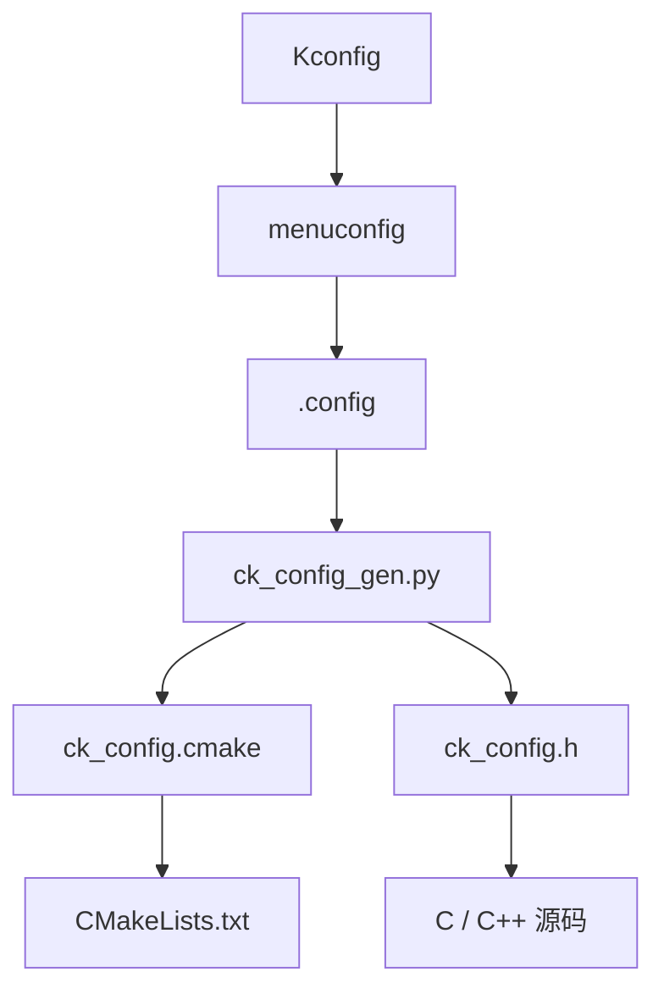

# Kconfig 配置与生成文件

## 1. Kconfig 的角色

CK Build 中，Kconfig 是工程配置入口。

同一份配置会同时给三类对象使用：

```text
Kconfig / .config
    ├── Python：读取工具路径、构建目录、构建命令
    ├── CMake：通过 ck_config.cmake 读取构建变量
    └── C / C++：通过 ck_config.h 读取宏定义
```

这样可以避免一份配置在 Python、CMake 和代码里重复维护。

## 2. 工程 Kconfig 顶部配置

工程 Kconfig 顶部通常包含一段工具配置：

```kconfig
# CK_TOOL_CONFIG_START
# 配置ck_tools的路径
CK_TOOLS_ROOT = ../../..
# 配置工作区路径
CK_WORKSPACE_ROOT = ../..
# 项目类型目前支持[STANDARD STM32CUBEMX]
CK_PROJECT_TYPE = STANDARD
# python ck_tools的构建命令
CK_CMD_CONFIGURE = cmake -S . -B build -G Ninja
# python ck_tools的编译命令
CK_CMD_BUILD = cmake --build build -j4
# python ck_tools的清理命令
CK_CMD_CLEAN = cmake --build build --target clean
# CK_TOOL_CONFIG_END
```

随后会导出成 Kconfig symbol：

```kconfig
config CK_TOOLS_ROOT
    string
    default "$(CK_TOOLS_ROOT)"
```

这种写法的目的是：

- 顶部路径方便用户直接看和改。
- 后续 `config xxx` 统一导出给 Python 和 CMake。

## 3. 核心配置项说明

### 3.1 `CK_TOOLS_ROOT`

`ck_tools` 所在路径。

工程侧 `ck_tool.py` 会先读取这个变量，再把它加入 Python import 路径。

复制模板后最容易出错的就是这个路径。

示例：

```text
CK_TOOLS_ROOT = ../../..
```

如果工程目录移动了，需要同步修改。

### 3.2 `CK_WORKSPACE_ROOT`

工作区根路径，通常用于定位公共 package：

```kconfig
source "$(CK_WORKSPACE_ROOT)/package/Kconfig"
```

如果你的工程不需要公共 package，也可以保留该字段但不使用。

### 3.3 `CK_PROJECT_TYPE`

工程类型标识。

当前模板常见值：

| 值 | 说明 |
| --- | --- |
| `STANDARD` | 标准 C / C++ 工程 |
| `STM32CUBEMX` | STM32CubeMX 工程 |

注意：`CK_PROJECT_TYPE` 主要用于 Kconfig 分支和模板约定。CMake 中具体使用哪个 profile，仍然由项目 `CMakeLists.txt` 明确调用。

例如标准工程：

```cmake
ck_profile_generic()
```

STM32 工程：

```cmake
ck_profile_stm32()
```

这样可以避免工程类型字符串在背后自动改变构建路径。

### 3.4 `CK_CMD_CONFIGURE`

CMake configure 命令。

标准工程示例：

```text
cmake -S . -B build -G Ninja
```

STM32 工程示例：

```text
cmake -S . -B build -G Ninja -DCMAKE_BUILD_TYPE=Debug -DCMAKE_TOOLCHAIN_FILE=cmake/gcc-arm-none-eabi.cmake
```

### 3.5 `CK_CMD_BUILD`

实际编译命令。

常用写法：

```text
cmake --build build -j4
```

### 3.6 `CK_CMD_CLEAN`

清理命令。

常用写法：

```text
cmake --build build --target clean
```

### 3.7 `PRO_NAME`

生成目标名称。

```kconfig
config PRO_NAME
    string "project name"
    default "ck_project"
```

它会影响：

- CMake project 名称。
- 可执行文件名称。
- STM32 工程 `.elf`、`.bin`、`.dis`、`.map` 等输出文件名称。

### 3.8 `CK_VERSION_ENABLE`

是否启用自动版本宏更新。

```kconfig
config CK_VERSION_ENABLE
    bool "enable ck-version function"
    default n
```

开启后，`make` 阶段会尝试更新 `ck_config.h` 中的：

```c
#define CK_SOFTWARE_VERSION "0.0.1"
#define CK_SOFTWARE_BUILD_TIME "1970-01-01 00:00:00"
#define CK_SOFTWARE_COMMIT_HASH "0000000"
```

### 3.9 `CK_TEST_UNIT`

是否启用单元测试注册。

```kconfig
config CK_TEST_UNIT
    bool "enable test unit function"
    default n
```

开启后，CMake 会调用 `enable_testing()`，并把当前目标注册为 CTest 测试项。

## 4. 工具链配置

标准工程会引入：

```kconfig
source "$(CK_TOOLS_ROOT)/ck_tools/Kconfig.toolchain"
```

常见配置项：

| 配置项 | 说明 |
| --- | --- |
| `TC_SYSTEM_NAME_*` | 目标系统类型，如 Generic、Windows、Linux、Darwin |
| `TC_CPU_*` | 目标 CPU 架构，如 x86_64、arm、aarch64、riscv64 |
| `TC_BUILD_TYPE_*` | 构建类型，如 Debug、Release |
| `TC_CROSSCOMPILING` | 是否交叉编译 |
| `TC_C_STANDARD` | C 标准 |
| `TC_CXX_STANDARD` | C++ 标准 |
| `TC_C_CXX_COMPILER` | C/C++ 编译器路径或命令 |
| `TC_DEFINE_MACROS` | 额外宏定义 |
| `TC_COMPILE_OPTIONS` | 编译参数 |
| `TC_LINK_OPTIONS` | 链接参数 |
| `TC_LIBRARY_DIRS` | 库搜索路径 |
| `TC_LINK_LIBRARIES` | 链接库 |
| `TC_LINK_FILE` | 链接脚本 |
| `TC_GENERATE_BIN` | 是否生成 bin 文件 |
| `TC_GENERATE_DISASSEMBLY` | 是否生成反汇编文件 |
| `TC_GENERATE_MAP_FILE` | 是否生成 map 文件 |

STM32 工程默认使用 CubeMX / 工具链文件管理交叉编译，不默认引入通用 `Kconfig.toolchain`。

## 5. 外部模块配置区

工程 Kconfig 中有一段外部模块扫描区：

```kconfig
# CK_TOOL_EXTERNAL_START
source "$(CK_WORKSPACE_ROOT)/package/Kconfig"
# CK_TOOL_EXTERNAL_END
```

CMake 中的：

```cmake
ck_collect_kconfig_external_paths(KCONFIG_FILE "${CMAKE_CURRENT_SOURCE_DIR}/Kconfig")
```

会扫描这一段，只解析两个标记之间的 `source "xxx/Kconfig"`。

注意事项：

- 外部模块必须写在 `CK_TOOL_EXTERNAL_START` 和 `CK_TOOL_EXTERNAL_END` 之间。
- `source` 目标必须指向某个目录下的 `Kconfig`。
- 该目录最好同时提供 `CMakeLists.txt`。
- 如果缺少结束标记，CMake 会报错。

## 6. 生成文件关系

执行：

```bash
python ck_tool.py config
```

会得到：

```text
.config
ck_config.cmake
ck_config.h
```

关系如下：



## 7. `.config`

`.config` 是 Kconfig 的配置结果。

示例：

```text
CONFIG_PRO_NAME="ck_project"
CONFIG_CK_VERSION_ENABLE=n
CONFIG_CK_TEST_UNIT=n
```

`ck_config_gen.py` 解析时会移除 `CONFIG_` 前缀。

例如：

```text
CONFIG_PRO_NAME="ck_project"
```

会变成：

```cmake
set(PRO_NAME "ck_project")
```

和：

```c
#define PRO_NAME "ck_project"
```

## 8. `ck_config.cmake`

`ck_config.cmake` 给 CMake 使用。

示例：

```cmake
set(CK_TOOLS_ROOT "../../..")
set(CK_WORKSPACE_ROOT "../..")
set(PRO_NAME "ck_project")
set(CK_VERSION_ENABLE "n")
```

项目 `CMakeLists.txt` 一般开头直接包含：

```cmake
include(ck_config.cmake)
```

注意：

- 该文件由脚本生成，不建议手动修改。
- 如果 Kconfig 修改后没有重新执行 `config`，CMake 读到的仍然是旧值。

## 9. `ck_config.h`

`ck_config.h` 给 C/C++ 代码使用。

示例：

```c
#ifndef __CK_CONFIG_H__
#define __CK_CONFIG_H__

#define CK_TEST_UNIT 0
#define CK_VERSION_ENABLE 0
#define PRO_NAME "ck_project"

#endif /* __CK_CONFIG_H__ */
```

转换规则：

| Kconfig 值 | C 宏值 |
| --- | --- |
| `y` | `1` |
| `n` | `0` |
| 字符串 | 保持字符串形式 |
| 数值 | 保持数值形式 |

## 10. 版本宏生成策略

当 `CK_VERSION_ENABLE=n` 时，版本宏不会写入 `ck_config.h`。

当 `CK_VERSION_ENABLE=y` 时，`ck_config_gen.py` 会保证 `ck_config.h` 中存在：

```c
#define CK_SOFTWARE_VERSION "0.0.1"
#define CK_SOFTWARE_BUILD_TIME "1970-01-01 00:00:00"
#define CK_SOFTWARE_COMMIT_HASH "0000000"
```

之后执行：

```bash
python ck_tool.py make
```

会调用 `ck_version.py` 更新这些宏。

版本策略：

- 如果 Git commit hash 变化：`minor + 1`，`patch = 0`。
- 如果 Git commit hash 不变：`patch + 1`。
- `major` 不自动增加，由用户自行决定。

## 11. 文件提交建议

| 文件 | 建议 | 说明 |
| --- | --- | --- |
| `Kconfig` | 提交 | 工程配置定义 |
| `.config` | 可提交 | 默认配置快照，方便别人直接构建 |
| `ck_config.h` | 可按需求提交 | 如果需要保留版本宏，建议提交 |
| `ck_config.cmake` | 通常不提交 | 可由 `.config` 再生成 |
| `.config.old` | 不提交 | menuconfig 过程文件 |
| `build/` | 不提交 | 构建目录 |
| `bin/` | 不提交 | 产物目录 |

## 12. 修改配置后的推荐操作

只改 C/C++ 源码：

```bash
python ck_tool.py make
```

改了 Kconfig 配置：

```bash
python ck_tool.py config
python ck_tool.py build
python ck_tool.py make
```

改了 CMakeLists 或工具链文件：

```bash
python ck_tool.py build
python ck_tool.py make
```

改了外部模块的 Kconfig source：

```bash
python ck_tool.py config
python ck_tool.py build
python ck_tool.py make
```
